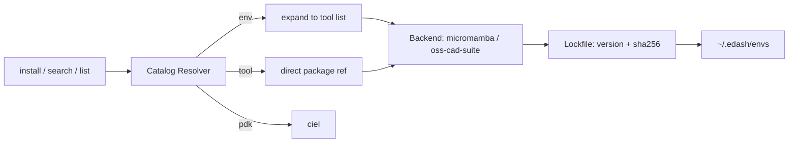

# edash — architecture

_rustup/pyenv semantics, applied to EDA toolchains and PDKs._

## Design principles

- Never touch system package manager for tool versions (apt/dnf/pacman drift across distros and time).
- Lock file is the unit of reproducibility — same lock, same bits, any machine.
- Backend is an implementation detail behind a trait, not a fork in the codebase.
- No telemetry, no phone-home.
- Wrap proven upstream distributors (litex-hub, oss-cad-suite, ciel) instead of rebuilding packaging pipelines — fall back to a source build only when no package exists (Xyce/Trilinos).

## Non-goals (v1)

- Windows native support (WSL fine via existing backends)
- GUI desktop app
- Proprietary tool integration (Cadence/Synopsys — licensing wall, out of scope)
- Full Nix/distrobox backend parity at launch — micromamba ships first

## Repo layout

```
edash/
├── src/
│   ├── main.rs
│   ├── cli/
│   │   ├── install.rs
│   │   ├── list.rs
│   │   ├── search.rs
│   │   ├── verify.rs
│   │   ├── doctor.rs
│   │   ├── update.rs
│   │   ├── outdated.rs        # new
│   │   ├── why.rs              # new
│   │   ├── remove.rs
│   │   ├── clean.rs            # new
│   │   ├── cache.rs            # new
│   │   ├── env.rs              # new — eval-able activation
│   │   ├── shell.rs
│   │   ├── export.rs
│   │   └── init.rs             # new — project scaffold
│   ├── catalog/
│   │   ├── index.rs             # kind-tagged registry: env | tool | pdk
│   │   ├── resolver.rs          # name -> package list, polymorphic
│   │   └── source.rs            # remote catalog fetch + cache
│   ├── manifest/
│   │   └── schema.rs             # edash.yaml (declared ranges)
│   ├── lockfile/
│   │   ├── schema.rs              # edash.lock (resolved + sha256)
│   │   ├── writer.rs
│   │   └── verifier.rs
│   ├── backend/
│   │   ├── mod.rs                 # Backend trait
│   │   ├── micromamba.rs          # default, v1
│   │   ├── oss_cad_suite.rs       # v1, fpga/formal
│   │   ├── nix.rs                 # phase 3
│   │   ├── distrobox.rs           # phase 3
│   │   └── source.rs              # phase 3
│   ├── pdk/
│   │   └── ciel.rs                 # wraps ciel (fka Volare)
│   ├── doctor/
│   │   ├── checks.rs                # functional micro-benchmarks
│   │   └── report.rs
│   ├── config.rs                     # resolution: cli > project > user > default
│   └── paths.rs                      # XDG dirs
├── catalog/                            # community-editable registry, versioned separately from core
│   ├── index.yaml                      # environments + pdks
│   ├── tools.yaml                      # flat tool registry, single source of truth
│   ├── digital.yaml
│   ├── analog.yaml
│   ├── fpga.yaml
│   └── formal.yaml
├── tests/
│   ├── mock_backend.rs                 # fake backend, no GB downloads in CI
│   └── resolver.rs
├── Cargo.toml
├── README.md
├── CLAUDE.md                            # persistent rules, short — see CLAUDE.md
└── PLAN.md                              # build sequence + TUI spec, see PLAN.md
```

## CLI surface

| Command                 | Behavior                                                                  |
| ----------------------- | ------------------------------------------------------------------------- |
| `install <name...>`     | resolves each arg (env/tool/pdk) via catalog, installs, updates lock      |
| `list`                  | installed packages + versions                                             |
| `search <query>`        | fuzzy match across catalog (env/tool/pdk)                                 |
| `verify`                | fast — hash-check installed vs lock, no execution                         |
| `doctor`                | slow — functional micro-benchmark per tool                                |
| `update`                | re-resolve manifest ranges, rewrite lock                                  |
| `outdated`              | diff lock vs latest catalog, no changes made                              |
| `why <tool>`            | show which env/manifest entry pulled a tool in                            |
| `remove <name>`         | uninstall, prune from lock                                                |
| `clean`                 | prune unreferenced cache entries                                          |
| `cache`                 | inspect/clear download cache                                              |
| `env <name>`            | print activation script (`eval`-able)                                     |
| `shell <name>`          | spawn subshell with env activated                                         |
| `export --format <fmt>` | `github-actions`, `dockerfile`, `offline-bundle`                          |
| `init [profile]`        | scaffold project: `edash.yaml`, Makefile, `.gitignore`, starter testbench |

## Catalog — unified, kind-tagged resolution

One resolution path for environments, individual tools, and PDKs — `install digital`, `install xschem ngspice`, `install sky130` all hit the same resolver.



```yaml
# catalog/index.yaml — environments + pdks only; tool defs live in tools.yaml
environments:
  digital: catalog/digital.yaml
  analog: catalog/analog.yaml
  fpga: catalog/fpga.yaml
  formal: catalog/formal.yaml

pdks:
  sky130: { manager: ciel, variant: sky130A }
  gf180: { manager: ciel, variant: gf180mcuD }
  ihp-sg13g2: { manager: open_pdks, build: source } # no ciel prebuilt yet — verify before relying on it
```

```yaml
# catalog/tools.yaml — flat registry, single source of truth, one entry per tool
xschem: { backend: micromamba, channel: litex-hub, package: xschem }
ngspice: { backend: micromamba, channel: conda-forge, package: ngspice }
xyce:
  {
    backend: source,
    repo: "https://xyce.sandia.gov/downloads/source-code/",
    requires: [cmake, trilinos],
    mpi: optional,
  }
magic: { backend: micromamba, channel: litex-hub, package: magic }
klayout: { backend: micromamba, channel: litex-hub, package: klayout }
netgen: { backend: micromamba, channel: litex-hub, package: netgen }
gaw: { backend: micromamba, channel: litex-hub, package: gaw }
yosys: { backend: micromamba, channel: litex-hub, package: yosys }
openroad: { backend: micromamba, channel: litex-hub, package: openroad }
opensta: { backend: micromamba, channel: litex-hub, package: opensta }
verilator: { backend: micromamba, channel: conda-forge, package: verilator }
gtkwave: { backend: micromamba, channel: conda-forge, package: gtkwave }
iverilog: { backend: micromamba, channel: conda-forge, package: iverilog }
nextpnr: { backend: oss-cad-suite }
icestorm: { backend: oss-cad-suite }
prjtrellis: { backend: oss-cad-suite }
openfpgaloader: { backend: oss-cad-suite }
sby: { backend: oss-cad-suite }
boolector: { backend: oss-cad-suite }
z3: { backend: oss-cad-suite }
```

```yaml
# catalog/digital.yaml
name: digital
tools:
  [
    yosys,
    openroad,
    klayout,
    magic,
    netgen,
    opensta,
    verilator,
    gtkwave,
    iverilog,
  ]
```

```yaml
# catalog/analog.yaml — both spice engines kept; xschem targets ngspice by
# default, override per-project via edash.yaml if xyce preferred.
# xyce resolves via the source backend (phase 3); rest of this list is v1.
name: analog
tools: [xschem, ngspice, xyce, magic, klayout, netgen, gaw]
```

```yaml
# catalog/fpga.yaml + formal.yaml — every tool here resolves via oss-cad-suite, not conda
name: fpga
tools: [yosys, nextpnr, icestorm, prjtrellis, openfpgaloader, gtkwave]
---
name: formal
tools: [yosys, sby, boolector, z3]
```

litex-hub carries the ASIC backend/signoff stack; oss-cad-suite carries synthesis/FPGA/formal; anything without a package (Xyce) falls to the source backend. Resolver looks each name up in `tools.yaml` once, regardless of how many environments reference it — no duplicate definitions to drift out of sync.

Channel/package names above are illustrative — confirm exact strings with `micromamba search -c litex-hub <tool>` before locking.

## Manifest vs lock

Two files, two jobs — collapsing them into one flat version list (as in the original draft) loses the declared-vs-resolved distinction Cargo/npm/poetry all rely on.

```yaml
# edash.yaml — project manifest, declared, committed, human-edited
environments: [digital, formal]
pdk:
  sky130: { variant: sky130A }
overrides:
  yosys: ">=0.56"
```

```toml
# edash.lock — resolved, committed, machine-generated only
version = 1
generated = "2026-07-07T00:00:00Z"

[[package]]
name = "yosys"
version = "0.56"
channel = "litex-hub"
backend = "micromamba"
sha256 = "b3f2c1a9e91a4d7f6b0c8e3a1f5d9c2b7e4a6f8d0c1b3a5e7f9d1c3b5a7e9f1d"

[[package]]
name = "openroad"
version = "2.0-18439"
channel = "litex-hub"
backend = "micromamba"
sha256 = "1a9c44de5b3f2c8e1a4d7f6b0c8e3a1f5d9c2b7e4a6f8d0c1b3a5e7f9d1c3b5"

[pdk.sky130]
variant = "sky130A"
manager = "ciel"
ref = "a1b2c3d4"
sha256 = "9f0e2b71c1a9e91a4d7f6b0c8e3a1f5d9c2b7e4a6f8d0c1b3a5e7f9d1c3b5a7"
```

`install`/`update` write the lock. Every other command reads it. `sha256` is checked on every `verify`, not just first fetch — catches a channel serving a mutated artifact under an unchanged version string.

## Backend abstraction

```rust
pub trait Backend {
    fn name(&self) -> &'static str;
    fn resolve(&self, req: &PackageRequest) -> Result<ResolvedPackage>;
    fn install(&self, pkg: &ResolvedPackage, progress: ProgressTx) -> Result<()>;
    fn verify(&self, pkg: &ResolvedPackage) -> Result<bool>;    // hash check only
    fn activate(&self, env: &Environment) -> Result<ShellEnv>;  // for `env`/`shell`
    fn remove(&self, pkg: &ResolvedPackage) -> Result<()>;
}

pub enum Progress {
    Stage(&'static str),            // "resolving", "verifying"
    Bytes { done: u64, total: u64 },
    Log(String),                     // always tee'd to disk; TUI shows it only in the log drawer
    Done,
    Failed(String),
}
pub type ProgressTx = tokio::sync::mpsc::UnboundedSender<Progress>;
```

`ProgressTx` exists for the TUI (see `PLAN.md`) — every backend reports through it even in non-interactive CLI mode, where it's just rendered as plain stdout lines. One code path, two renderers.

| Backend                            | Repro.  | Speed         | GUI (X11/Wayland)           | Ships in |
| ---------------------------------- | ------- | ------------- | --------------------------- | -------- |
| micromamba (litex-hub/conda-forge) | high    | fast          | native                      | v1       |
| oss-cad-suite (tarball)            | high    | fast          | native                      | v1       |
| nix (nix-eda)                      | highest | fast (cached) | native                      | phase 3  |
| distrobox (podman/docker)          | high    | fast          | native (host socket shared) | phase 3  |
| source build                       | medium  | slow          | native                      | phase 3  |

Distrobox over raw Docker/Podman specifically because it shares host X11/Wayland/audio/HOME automatically — the GUI-forwarding pain point stops being edash's problem to solve.

Xyce has no conda-forge/litex-hub package, but the tarball itself is a plain, ungated download — no account needed. Only the official prebuilt binary (`XyceNF`, RHEL8 RPM only) is restricted, and it bundles proprietary models anyway, so it's not the build edash wants. `source` backend fetches the tarball, builds against Trilinos via CMake, MPI optional for the parallel ("multicore") variant.

## Backend bootstrapping

edash's backends are not assumed to be preinstalled. On first use of any backend, edash checks whether the binary is on `PATH` and, if missing, offers to fetch it to `~/.edash/bin/`. This is the same model `rustup` uses for toolchains — one command, self-contained, no system package manager involved.

**micromamba** (v1, default): single static C++ binary, ~25 MB, zero runtime dependencies. If not found on `PATH`: offer `curl -L micro.mamba.pm/install.sh | bash` equivalent (download + extract to `~/.edash/bin/micromamba`). User can decline — in that case, print the install URL and exit with a clear message. No root, no Python, no pollution outside `~/.edash/`.

**oss-cad-suite** (v1, FPGA/formal): prebuilt tarball from GitHub releases. Fetched on demand, extracted to `~/.edash/envs/` — same model, different artifact shape. The tarball is self-contained (static-linked binaries), so no additional dependencies beyond what's in the archive.

**ciel** (v1, PDK): single Python package (`pip install ciel`). If not found: offer `pip install --user ciel` or install into edash's own venv under `~/.edash/`. The venv approach is preferred — it avoids touching the user's system Python and guarantees a known-good version.

**nix / distrobox / source** (phase 3): each will need its own preflight check, but the principle is the same — detect, offer, fall back to a clear error message.

This means edash itself remains a pure Rust static binary. The backends it drives are fetched on demand, not bundled. The `doctor` command checks backend availability as part of its preflight before running functional tests.

## PDK handling

Wraps `ciel` (formerly Volare — same Efabless/ChipFoundry lineage, renamed upstream) instead of reimplementing PDK fetch/version logic. `install sky130` → catalog marks it `manager: ciel` → shells out to `ciel enable --pdk sky130 <ref>` → records the resolved commit + hash in the lock.

## Doctor vs verify

Two commands, two costs — the original draft treated them as one job.

- **`verify`**: lock hash vs installed file hash. Milliseconds. Catches corruption/tampering.
- **`doctor`**: actually runs each tool. Seconds to minutes. Catches broken shared libs (`libxaw`, `libncurses`) that a present-and-hash-correct binary can still fail on.

| Tool      | doctor check                                      |
| --------- | ------------------------------------------------- |
| yosys     | synthesize 3-line module → JSON                   |
| openroad  | load empty design, run `init_floorplan`           |
| ngspice   | DC sweep on resistor divider, check output vector |
| xyce      | same DC sweep, cross-check against ngspice output |
| magic     | headless boot, run DRC on test cell               |
| klayout   | load + export GDS round-trip                      |
| verilator | compile + run trivial testbench                   |
| sby       | run trivial `sat` task to completion              |

## Config resolution order

1. CLI flags
2. Project `edash.yaml` (walked upward from cwd, git-style)
3. User `~/.config/edash/config.toml`
4. Built-in defaults

## On-disk layout

```
~/.edash/
├── config.toml
├── envs/
│   ├── digital/        # micromamba prefix
│   ├── analog/
│   └── fpga/
├── pdks/                # ciel-managed
├── cache/                # content-addressed downloads
└── bin/                  # bootstrapped backends (micromamba) + shims
```

## Shell integration

```bash
edash env digital              # prints export statements
eval "$(edash env digital)"    # activate in current shell, no subshell
edash shell digital            # or: spawn a subshell
```

## Export

```bash
edash export --format github-actions > .github/workflows/eda-ci.yml
edash export --format dockerfile > Dockerfile
edash export --format offline-bundle --env digital -o digital-bundle.tar.zst
```

Offline bundle matters more than CI export for this domain specifically — IP-controlled EDA labs are commonly air-gapped. USB-transferable pre-resolved bundles solve a real problem CI export doesn't touch.

## Project pin (rustup/pyenv-style)

`edash.yaml` present in a directory, or any parent, auto-selects that environment on `cd` — same pattern as `.nvmrc` / `rust-toolchain.toml`. No manual `edash shell` needed inside a project tree once the shell hook is sourced once.

## Tech stack

| Choice                        | Why                                                                                                                                                                                    |
| ----------------------------- | -------------------------------------------------------------------------------------------------------------------------------------------------------------------------------------- |
| **Rust + clap** (recommended) | static binary, zero runtime dep, `reqwest`+`indicatif` for fetch/progress, cross-compiles to aarch64 via musl                                                                          |
| Go + cobra (fallback)         | simpler than Rust, still a static binary, faster v1 if Rust is the bottleneck                                                                                                          |
| Python + Typer                | avoid for the installer itself — a dependency manager needing a Python runtime pre-installed undercuts its own pitch. Fine for internal automation scripts, not the distributed binary |

## Testing

Mock backend (`tests/mock_backend.rs`) fakes install/verify without pulling real binaries — CI validates manifest resolution, lock generation, and catalog parsing in seconds, not gigabytes.

## Roadmap

| Phase | Scope                                                                      |
| ----- | -------------------------------------------------------------------------- |
| 0     | manifest + lock + micromamba backend; `install`/`list`/`verify`/`remove`   |
| 1     | catalog registry + PDK (`ciel`) + `doctor` + `env`/`shell`                 |
| 2     | `outdated`/`why`/`clean`/`cache`, CI export, offline bundle export         |
| 3     | nix + distrobox + source backends as plugins; project pin file auto-switch |

This table is capability scope, not build order. `PLAN.md` sequences the actual work (TUI included) — that's the file to follow session to session.
